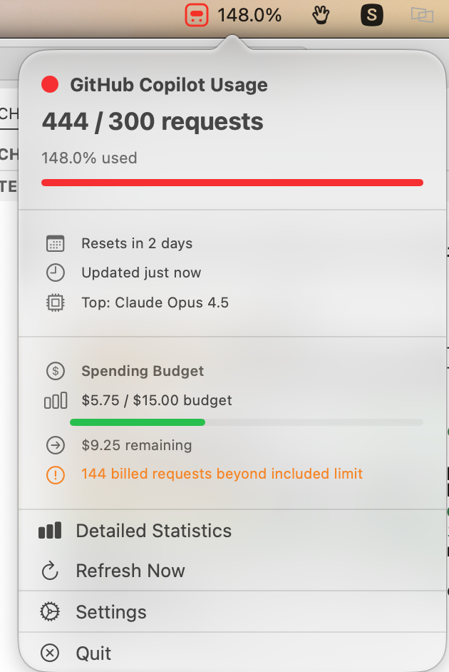
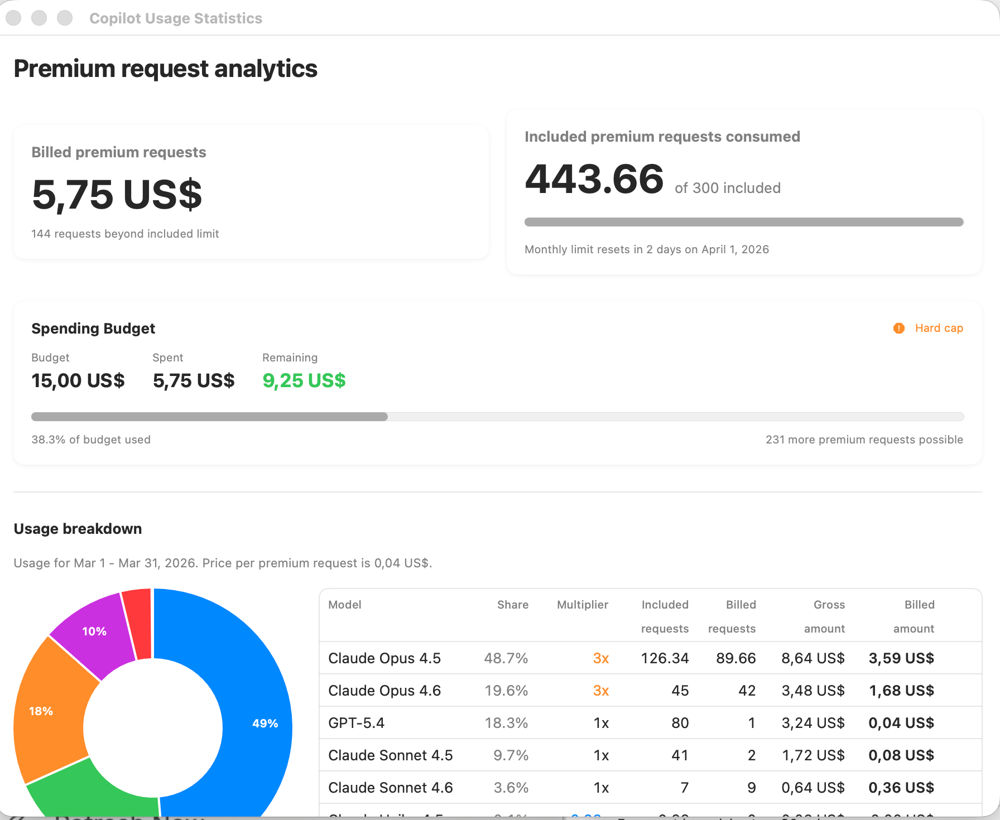

# Copilot Accountant

A native macOS menu bar app that tracks your GitHub Copilot premium request usage in real-time.


## Screenshots

### Menu Bar Popup

Quick overview of your usage, spending budget, and top model — one click away from the menu bar.



### Detailed Statistics

Full analytics window with billing breakdown, spending budget, and interactive model usage pie chart.



## Features

- **Copilot Icon in Menu Bar**: Color-coded Copilot visor icon reflects your current usage status at a glance
- **Real-time Usage Tracking**: Current premium requests consumed vs. your monthly limit, with percentage and color-coded progress bar
- **Spending Budget**: Tracks dollar spend against your configured budget — shown in both the popup and the detailed stats window
- **Model Usage Breakdown**: Interactive pie chart + billing table showing each model's share, multiplier, included requests, billed requests, gross amount, and billed amount
- **Detailed Statistics Window**: Full analytics with billing cards, spending budget card, and usage breakdown by model
- **Budget Alerts**: macOS notifications at 80% and 90% usage thresholds
- **Automatic Polling**: Checks GitHub API every 5 minutes (configurable)
- **Secure Token Storage**: GitHub token safely stored in macOS Keychain
- **Persistent Cache**: Usage data cached locally for offline viewing

### Color-coded Status

| Color | Threshold | Meaning |
|-------|-----------|---------|
| Green | 0–59% | Safe |
| Yellow | 60–79% | Moderate |
| Orange | 80–89% | High |
| Red | 90%+ | Critical |

## Requirements

- macOS 14.0 (Sonoma) or later
- GitHub account with Copilot subscription
- GitHub Personal Access Token with "Plan" read access
- Swift 6.0+ (included with Xcode Command Line Tools)

## Installation

### Quick Install (Recommended)

```bash
git clone https://github.com/matlockx/copilot-accountant.git
cd copilot-accountant
./build-direct.sh release
sudo ./install.sh
```

This builds the app and installs it to `/Applications/CopilotAccountant.app`.

### Manual Build

1. Clone and build:
   ```bash
   git clone https://github.com/matlockx/copilot-accountant.git
   cd copilot-accountant
   ./build-direct.sh release
   ```

2. Create the app bundle and move to Applications:
   ```bash
   mkdir -p CopilotAccountant.app/Contents/{MacOS,Resources}
   cp .build/release/CopilotAccountant CopilotAccountant.app/Contents/MacOS/
   cp Resources/Info.plist CopilotAccountant.app/Contents/
   chmod +x CopilotAccountant.app/Contents/MacOS/CopilotAccountant
   mv CopilotAccountant.app /Applications/
   ```

3. (Optional) Add to Login Items:
   - System Settings → General → Login Items
   - Or enable "Launch at Login" in app settings

> **Note**: No Xcode required. The app builds with `swiftc` directly via `build-direct.sh`.

## Setup

### 1. Create a GitHub Personal Access Token

1. Go to [GitHub Settings → Developer settings → Personal access tokens → Fine-grained tokens](https://github.com/settings/personal-access-tokens/new)
2. Click "Generate new token"
3. Give it a descriptive name (e.g., "Copilot Accountant")
4. Set expiration as desired
5. Under "Account permissions", find **"Plan"** and set it to **"Read-only"**
6. Click "Generate token"
7. **Copy the token immediately** — you won't see it again

> Classic tokens (with scopes like `read:user`) will **not** work. You must use a fine-grained token with "Plan" access.

### 2. Configure the App

1. Launch Copilot Accountant from your Applications folder
2. Click the Copilot icon in the menu bar
3. Click **Settings**
4. Enter your **GitHub Username** and paste your **Personal Access Token**
5. Click **Save Token**, then **Validate** to test the connection
6. Adjust your settings:
   - **Monthly Budget**: Default is 300 requests — adjust for your plan
   - **Dollar Budget**: Optional spending cap (shown in the popup and stats window)
   - **Polling Interval**: How often to check for updates (default: 5 minutes)
   - **Notifications**: Toggle alerts at 80% and 90%
7. Click **Save**

### 3. Understanding Your Plan

| Plan | Premium Requests/Month |
|------|----------------------|
| Copilot Free | Limited |
| Copilot Pro | 300 |
| Copilot Pro+ | Higher limit |
| Copilot Business/Enterprise | Varies |

Check your current plan and usage at [github.com/settings/billing](https://github.com/settings/billing).

## Troubleshooting

### "No data available"
- Check that your username and token are correct in Settings
- Click **Validate** to test your connection
- Ensure your GitHub account has an active Copilot subscription

### "Token validation failed"
- Verify your token has **"Plan" read** permission (fine-grained token, not classic)
- Try regenerating the token on GitHub
- Make sure you copied the full token without leading/trailing spaces

### "Failed to fetch usage data"
- GitHub API may be temporarily unavailable — check [githubstatus.com](https://www.githubstatus.com/)
- You may have hit the API rate limit (unlikely with default 5-minute polling)

## API

This app uses the GitHub REST API:
```
GET /users/{username}/settings/billing/premium_request/usage
```

See [GitHub Billing Usage API docs](https://docs.github.com/en/rest/billing/usage) for details.

## Privacy & Security

- Your GitHub token is stored in the **macOS Keychain** — never in plain text
- All API requests go directly from your Mac to GitHub — no third-party servers
- Usage data is cached locally; nothing leaves your machine
- No telemetry or analytics

## Technical Details

- **Language**: Swift 6.0+
- **Frameworks**: SwiftUI, Swift Charts, AppKit
- **Platform**: macOS 14.0+ (Sonoma)
- **Build system**: Direct `swiftc` compilation (no SPM or Xcode required)
- **Storage**: UserDefaults (config/cache) + Keychain (token)

## Project Structure

```
copilot-accountant/
├── Sources/
│   ├── App/
│   │   ├── CopilotAccountantApp.swift      # App entry point
│   │   ├── AppDelegate.swift               # Menu bar management
│   │   └── CopilotMenuBarIcon.swift        # Programmatic menu bar icon
│   ├── Models/
│   │   ├── UsageData.swift                 # API response models
│   │   ├── BudgetConfig.swift              # Configuration + status colors
│   │   └── WindowConfiguration.swift      # Window size constants
│   ├── Services/
│   │   ├── GitHubAPIService.swift          # API client
│   │   ├── KeychainService.swift           # Secure token storage
│   │   ├── ModelMultiplierService.swift    # Dynamic model multipliers
│   │   ├── NotificationService.swift       # macOS notifications
│   │   └── UsageTracker.swift              # Core tracking logic
│   └── Views/
│       ├── MenuBarView.swift               # Menu bar popup UI
│       ├── DetailedStatsView.swift         # Statistics window
│       └── SettingsView.swift              # Settings window
├── Tests/                                  # Test suite (529 tests)
├── build-direct.sh                         # Build script
├── run-tests.sh                            # Test runner
├── install.sh                              # Install to /Applications
└── FEATURES.md                             # Feature specification
```

## Contributing

Contributions are welcome. Please submit a Pull Request.

1. Fork the repository
2. Create your feature branch: `git checkout -b feature/my-feature`
3. Run tests before committing: `./run-tests.sh`
4. Commit your changes and open a Pull Request

## License

MIT License — see [LICENSE](LICENSE) for details.

## Disclaimer

This is an unofficial third-party application and is not affiliated with, endorsed by, or connected to GitHub or Microsoft. GitHub and Copilot are trademarks of their respective owners.
